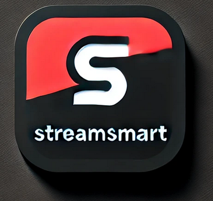

# StreamSmart
<p align="center">
    
</p>


## Presentation
**Note : StreamSmart is a recommendation-based application developed during the second year of studies at ENSAI. It guides users in selecting the most suitable streaming service subscriptions based on their cinematic preferences and budget. The project applies structured development practices, with integration of external APIs and a PostgreSQL database.**


This project aims to develop a tool to give you the best Provider for a watchlist of films based on your film's tastes.

## Main Features

- **User Account Management:**
  - Create, authenticate, and manage user accounts.
  - Secure password management with hashing and salt.
  
- **Film Search & Discovery:**
  - Search for films by title.
  - View detailed film information, including:
    - Descriptions
    - Release dates
    - Genres
    - Streaming platforms

- **Watchlist Management:**
  - Create and manage personalized watchlists.
  - Add or remove films in a watchlist.

- **Subscription Recommendation:**
  - Suggest optimal streaming subscriptions based on:
    - Price
    - Quality (e.g., HD, 4K)
    - Advertisement presence

- **Advanced Features:**
  - Support for tiered subscriptions (e.g., HD, 4K resolutions).
  - Exploration of niche subscription types (e.g., sports content).

---

## Technology Stack

- **Language:** Python
- **Database:** PostgreSQL
- **API Integration:** The Movie Database (TMDB) API
- **Version Control:** GitHub
- **Development Environment:** Visual Studio Code (VS Code)

## :hammer: Prerequisites

- [Python 3.10](https://www.python.org/)
- [PostgreSQL](https://www.postgresql.org/)
- [Git](https://git-scm.com/)
- [Visual Studio Code](https://code.visualstudio.com/)

---

## :computer: Installation

### Clone the Project

1. Open **Git Bash** or a terminal

2. Create a project folder:
   ```bash
   mkdir -p <folder_path> && cd $_
   ```
3. Clone this repository:
   ```bash
   https://github.com/gpmp58/StreamSmartGroupe11.git
   ```

### Configure Environment

1. Navigate to the project directory:
   ```bash
   cd <folder_path>
   ```
2. Install Python dependencies:
   ```bash
   pip install -r requirements.txt
   ```
3. Configure environment variables:
   - Rename `.env.template` to `.env`
   - Fill in your personal information instead of **xxxx**. Example:
     ```env
     Get your API KEY here :
     "https://developer.themoviedb.org/reference/intro/authentication"

     API_KEY="XXXX"
     POSTGRES_HOST=sgbd-eleves.domensai.ecole
     POSTGRES_PORT=5432
     POSTGRES_DATABASE=idxxxx
     POSTGRES_USER=idxxxx
     POSTGRES_PASSWORD=idxxxx
     POSTGRES_SCHEMA=projet
     ```

---
## How to run the App

After opening the project, in the terminal , run the following instruction :

1. **Initialize the database**:
   - Run the initialization script:
     ```bash
     python src/utils/reset_database.py
     ```
   - This will create the necessary tables and import base data

2. **Run the app**:
```
python start_application.py

```

By running this script you do these 4 steps :

- Installing the newer version of pip
- Installing all the requirements from requirements.txt
- Launching the webservice
- Launching the App


You can have access to our API's documentation [here](http://127.0.0.1:8000/docs)


## :wrench: Unit Tests

1. Run tests:
   ```bash
   python -m pytest -v
   ```
2. Generate coverage report:
   ```bash
   coverage run -m pytest
   coverage html
   ```
   - Open report: `htmlcov/index.html`

---

## :notebook_with_decorative_cover: Architecture

### Project Structure

```plaintext
src/
├── interface/                        # User interface (terminal display)
├── webservice/                       # the webservice of StreamSmart
  ├── business_object/                # Business objects and data models
  ├── dao/                            # Data access and database interaction
  ├── services/                       # Services exposing application features
  ├── tests/                          # Application functionality tests
  ├── utils/                          # Utility functions (reset the DataBase, hash function, etc.)
  ├── start_application.py            # Script to launch the App

```

### Main Tables

- **utilisateur**: Stores user credentials and personal information.
- **film**: Stores details about movies, including titles and metadata.
- **watchlist**: Manages user-created collections of favorite films.
- **film_watchlist**: Links movies to specific user watchlists.
- **film_plateforme**: Associates movies with streaming platforms.
- **plateforme_abonnement**: Manages subscription plans offered by streaming platforms.
- **abonnement**: Details subscription options, including price, resolution, and ad presence.


---


## 👨‍💻 Group Members

- Gaël Puentes-Mendes Pinto
- Ali Nour Guedemi Abdelwahid
- Ikram Drine
- Malo Le Lourd
- Laure Derasse


## Contributions

This project is designed to be extensible. You can:
- Add new features (e.g., advanced search, more filtering options)
- Improve performance (SQL query optimization)
- Enhance security (error handling, validations)

---

## 🙏 Acknowledgments

We would like to express our gratitude to our tutor, **Alexandre Bidon**, for his support and guidance throughout this project. 
His expertise and availability were invaluable in overcoming the technical and organizational challenges we faced, enabling us to successfully develop this application. 
Thank you for your mentorship !

:wave: **Thank you for your interest in *StreamSmart*!** Feel free to share your feedback or suggestions.
